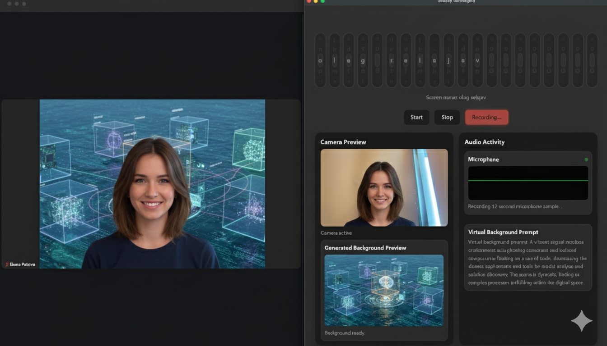

# Slowly Unhinged: Your AI-Powered Zoom Companion

**Slowly Unhinged** is a Zoom application built for the [No Keyboards Allowed](https://nokeyboardsallowed.dev/) hackathon.
It transforms your meeting experience by generating dynamic, AI-powered virtual backgrounds based on your live conversation, all controlled entirely by gestures and voice.

No more fumbling with settings menus. Simply speak, and watch your background evolve to reflect the topic of discussion.



## What is this?

The system is composed of three main parts:
1.  **The Companion App**: A native macOS application (built with Tauri) that runs on your machine. It manages local AI models (via Docker Model Runner), captures audio, and communicates with the Zoom App.
2.  **The Hub**: A lightweight, cloud-hosted server that acts as a matchmaker, connecting the Zoom App to your local Companion App without exposing your local machine directly to the internet (because Zoom apps can't connect to localhost).
3.  **The Zoom App**: The frontend application running inside your Zoom client, which connects to the Hub and sets the virtual backgrounds. 

## Features

*   **Voice-to-Background**: Automatically transcribes your speech and generates relevant, beautiful virtual backgrounds in real-time.
*   **Gesture Controls**: Use hand gestures to control the application without ever touching your keyboard.
    *   **Wheels Input**: An innovative, gesture-controlled rotary input system for entering your screen name.
    *   **Swipe Gestures**: Swipe up/down to spin the wheels, and left/right to switch between them.
    *   **Clap to Submit**: Clap your hands to confirm your screen name and start the agent.
*   **Privacy-First Architecture**: All audio processing and prompt generation happens locally on your machine. Only sanitized, non-identifiable prompts are sent to the cloud (Nano Banana) for image generation.

## Architecture Overview

We designed **Slowly Unhinged** to process as much data as possible locally.

1.  **Local Audio Processing**: The Companion App captures a 12-second audio snippet from your microphone. 
2.  **Local Transcription**: The audio is transcribed locally using the `ultravox` model running in Docker Model Runner.
3.  **Local Prompt Generation**: The transcript is then used to generate a prompt for a new virtual background, also locally, using the `gemma` model.
4.  **Nano Banana Image Generation**: Only the generated prompt (e.g., "a picture of a sailboat on the ocean") is sent to a Gemini to create the background.
5.  **Secure Tunneling**: The Companion App uses a secure tunnel (via `cloudflared`) to communicate with the Zoom App, brokered by our Hub. The Hub only stores your tunnel URL temporarily and never has access to your audio or transcripts.

This hybrid approach ensures that your conversations remain private while still leveraging the power of cloud-based AI for stunning visuals.

## Setup Instructions (macOS aarch64 only)

### Prerequisites

*   A Mac with Apple Silicon
*   [Docker Desktop](https://www.docker.com/products/docker-desktop/) installed and running.

### Step 1: Enable Docker Model Runner

1.  Open Docker Desktop.
2.  Go to **Settings > Features**.
3.  Enable the **Model Runner** feature.
4.  Apply & Restart.

### Step 2: Download the Models

The Companion App uses local AI models for transcription and prompt generation. You can pull these models ahead of time to speed up the initial setup.

Open your terminal and run the following commands (note, a pretty big download): 

```bash
docker model pull hf.co/ggml-org/ultravox-v0_5-llama-3_1-8b-gguf
docker model pull hf.co/unsloth/gemma-3n-e2b-it-gguf:q8_k_xl
```

### Step 3: Download and Run the Application

1.  Go to the [Releases page](https://github.com/your-repo/goose-hack/releases) (link to be added).
2.  Download the latest `.dmg` file for macOS.
3.  Open the `.dmg` and drag **Slowly Unhinged** to your Applications folder.
4.  Run the application.

### Settings File

The Companion App persists user preferences and runtime state in `~/Library/Application Support/com.slowlyunhinged.agent/settings.json` (created on first launch).

Editable fields:

- `model_transcription`: Docker Model Runner speech model ID. Change this to switch transcription engines.
- `model_prompt`: Prompt-generation model ID served by Docker Model Runner.
- `nanobanana_api_key`: Optional API key stored locally for Nano Banana image generation.
- `wheels`: Internal state for the on-screen name wheels (`positions` array and `active_index`). Delete this block or the file to reset the wheels.

Updates are picked up the next time the companion app loads the settings (on launch).

## Usage

1.  **Screen Name Entry**: On first launch, you will be prompted to enter your Zoom screen name. Use the gesture-controlled "wheels" to spell out your name.
    *   **Show palms and Swipe Up/Down**: Spin the active wheel.
    *   **Show palms Swipe Left/Right**: Switch to the previous/next wheel.
2.  **Start the Agent**: Once your zoom screen name is entered, **clap your hands** to start the agent. This will connect the Companion App to the Hub.
3.  **Join a Zoom Meeting**: Open the **Slowly Unhinged** app from the Apps panel in your Zoom meeting.
4.  **Generate Backgrounds**: The app will automatically detect when you are speaking and generate new backgrounds periodically and set them in the Zoom meeting.

## Models Used

*   **Transcription**: `hf.co/ggml-org/ultravox-v0_5-llama-3_1-8b-gguf`
*   **Prompt Generation**: `hf.co/unsloth/gemma-3n-e2b-it-gguf:q8_k_xl`
*   **Image Generation**: Google Gemini 2.5 Flash aka Nano Banana

## Development

To build the application from source:

1.  Clone the repository.
2.  Install the dependencies for the `hub` and `companion-app`:
    ```bash
    cd hub && npm install
    cd ../companion-app && npm install
    ```
3.  Build the Companion App:
    ```bash
    cd companion-app
    npm run tauri build
    ```
